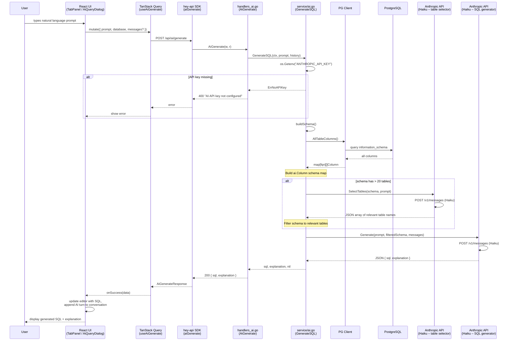

# AI SQL Generation

## Overview

Natural language to SQL generation via Anthropic Claude API. The flow uses schema-aware prompting with an optional table pre-filtering step for large databases.

## Key Files

- `pkg/ai/generate.go` — Anthropic API calls, schema formatting, table selection
- `pkg/service/ai.go` — Business logic: schema building, API key checks, fallback heuristics
- `pkg/api/handlers_ai.go` — Thin HTTP handler (parses request, calls service, writes response)
- `frontend/src/components/ai/AiQueryDialog.tsx` — Chat-style AI dialog
- `frontend/src/components/tabs/TabPanel.tsx` — Inline AI in query tabs
- `frontend/src/api/queries.ts` — `useAiGenerate()` mutation hook

## Sequence Diagram

## How It Works

1. **API key** is read from the `ANTHROPIC_API_KEY` environment variable in `service/ai.go`
2. **Schema introspection** — `service.buildSchema()` calls `Client.AllTableColumns()` to get all column names and types across all tables
3. **Table pre-filtering** (>20 tables only) — a cheap Haiku call receives just table names and picks the relevant subset, keeping the generation context small
4. **SQL generation** — filtered schema + conversation history + prompt sent to Haiku, which returns `{ sql, explanation }` as JSON
5. **Conversation support** — previous turns are passed as `messages[]` enabling multi-turn refinement

## Additional Endpoints

- **`GET /api/ai/suggestions`** — `service.AISuggestions()` fetches table names from PG and asks Haiku to generate contextual query suggestions
- **`POST /api/ai/tab-name`** — `service.AITabName()` generates a short tab name from SQL; falls back to `HeuristicTabName()` (regex-based) when no API key is set or AI fails

## Models

Both steps use **Claude Haiku 4.5** (`claude-haiku-4-5-20251001`):
- Table selection: system prompt asks for JSON array of relevant table names
- SQL generation: system prompt includes schema description + PostgreSQL rules

## Response Parsing

The generator expects JSON `{ sql, explanation }` but handles fallbacks:
1. Try direct JSON parse
2. Try extracting `{...}` from surrounding text
3. Fallback: treat entire response as raw SQL
